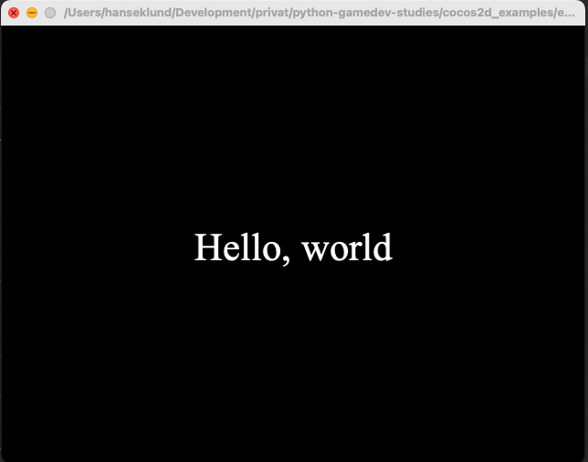
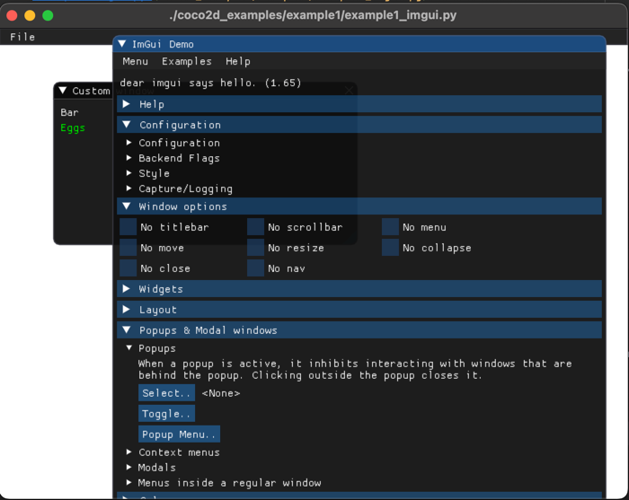
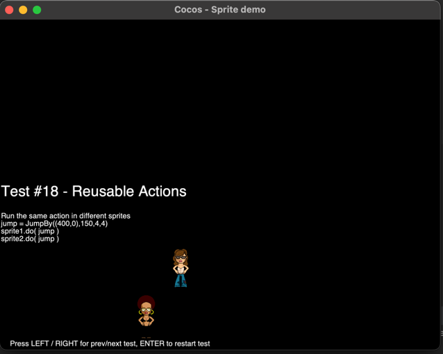
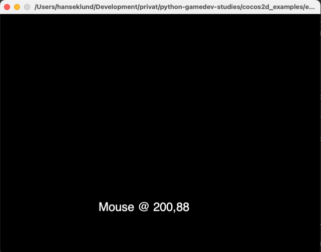
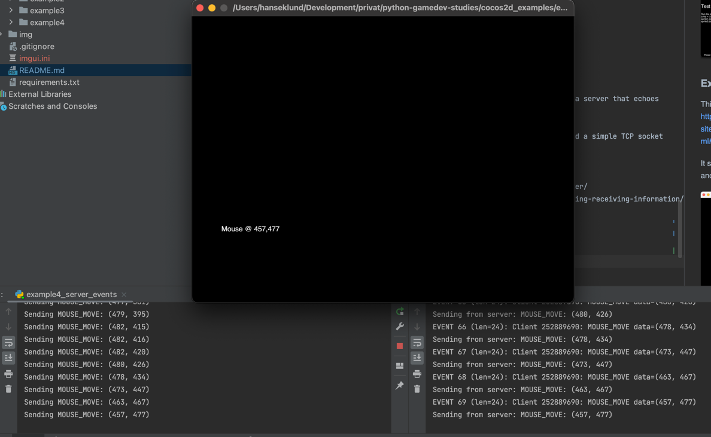

# Python Game Developers starting point
Last tested and working: January 2023.

Zero to hero suit of examples for the aspiring Python Game Developer. Seem to work well on
Python 3.10, all installed and contained in a virtual environment. Server components (when needed) 
are started using docker-compose.

The intention of this repository is mostly educational and to provide a skeleton for further 
development. It provides a well-defined starting point with developer setup instructions to get things going.

I [browsed for the available game frameworks](https://geekflare.com/python-game-development-libraries-frameworks/) 
and decided to first go for **cocos2d** as it seemed to be the best maintained and documented as of 2023.

Cocos-2D builds on **Pyglet** and the latest release (v0.6.9) was made in November 2020.

Main home page for Cocos-2D: http://los-cocos.github.io/cocos-site/, also see the [PyPi site](https://pypi.org/project/cocos2d/).

Coupled with the **ImGUI** library, it seems to be what I needed for now, and integration with that is
showed as a first example.

So for now focus will go to showing how to use that. At a later point I may show similar examples
for another framework. Runner ups, in order would be:

- Python Arcade: https://api.arcade.academy/en/latest/ looks well maintained.
- Ren'py for storytelling kind of games: https://www.renpy.org/
- Pandas3D.
- Possibly Pygame.

I quickly evaluated **Ogre** which seemes like a very capable C++ framework for graphics, but lacked 
in examples and documentation for Python especially for the later versions (2023). Pygame seemed
all-over a bit dated and not very actively maintained.

## Useful links for the game developer

https://gameprogrammingpatterns.com/

## Dev setup

### MAC
I recommend installing pyenv using brew (Homebrew).

    brew install pyenv

### Ubuntu
Like so:

    apt install pyenv

### Common
Set up a new virtual environment called 'pyg' using pyenv
 
    pyenv install 3.10
    pyenv virtualenv 3.10 pyg
    pyenv activate pyg

Install requirements needed for the examples

    pip install -r requirements.txt

And to run the first example:

    python ./cocos2d_examples/example1/example1_imgui.py

I use Pycharm for development, but any IDE or editor of choice will do.

## Cocos-2D Examples

Cocos-2D, API-Ref: http://los-cocos.github.io/cocos-site/doc/index.html

### Example 0: Hello World!

Source: [example1_imgui.py](cocos2d_examples/example1/example1_imgui.py).

This one is simply the hello-world example found in the quickstart:

http://los-cocos.github.io/cocos-site/doc/programming_guide/quickstart.html

### Example 1: Coco and ImGUI

Source: [example1_imgui.py](cocos2d_examples/example1/example1_imgui.py).

More on ImGui for Python: https://pyimgui.readthedocs.io/en/latest/guide/first-steps.html

The example is based upon this code: https://github.com/pyimgui/pyimgui/blob/master/doc/examples/integrations_cocos2d.py

with a fix to the broken ImGui base class.

Purpose, to:
- Show a very basic Coco application skeleton opening a window.
- Show how to integrate ImGUI with cocos to make settings to the application dynamically.

### Example 2: Coco Sprites

This example is based on: https://github.com/los-cocos/cocos/blob/master/samples/demo_sprites.py

It shows of a host of useful sprite transformation routines useful for game developers.

The same [repository](https://github.com/los-cocos/cocos/blob/master/samples/) contains a number of other useful examples
that you could check out.

### Example 3: Mouse events

This example is based on this one: http://los-cocos.github.io/cocos-site/doc/programming_guide/quickstart.html#handling-events

It shows how to work with mouse move and click events.

### Example 4: Networking; Sending messages to a TCP server

This is Example 3 with the addition of sending the mouse-coordinates to a server that echoes
the coordinates to its console.

This example also showcases how to use Msgpack (https://msgpack.org/) and a simple TCP socket
client and server.

Additions are loosely based on: 
- https://www.techwithtim.net/tutorials/python-online-game-tutorial/server/
- https://www.techwithtim.net/tutorials/python-online-game-tutorial/sending-receiving-information/

Will build on this example over next couple of examples.

As seen in screenshot, moving the mouse over the window will transfer the coordinates
to the server. It also echoes them back to the client, but no client reception code
is yet implemented, that is coming up in the next example.

### Example 5: Networking: Updating the game client from server
Here we build on the last example, adding a threaded receiver, putting messages
on a Queue for processing/dispatching to the game client.

Ideas from:
- https://dzone.com/articles/understanding

### Example X: Separating content and engine.

### Example X: The structure of a simple game

...
