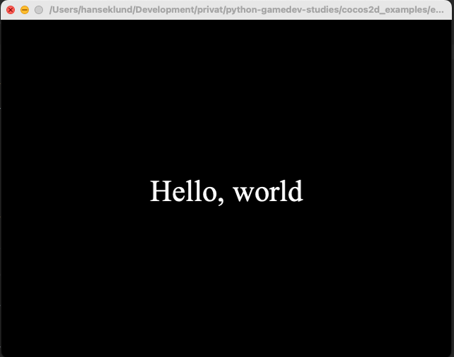
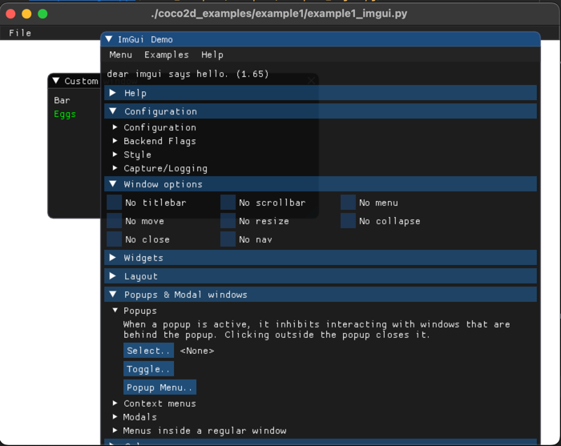
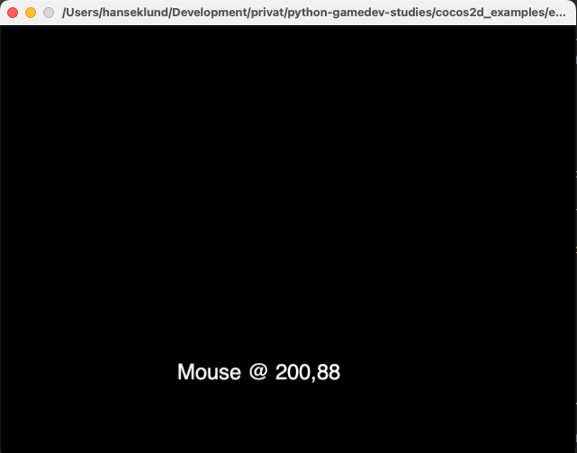

# Python Game Developers starting point
Last tested and working: January 2023.

Suit of examples for the aspiring Game Developer that possess some python skills. Seem to work well on
Python 3.10, all installed and contained in a virtual environment. Server components (when needed) 
are started using docker-compose.

The intention of this repository is mostly educational and to provide a skeleton for further 
development. It provides a well-defined starting point with developer setup instructions to get things going.

I [browsed for the available game frameworks](https://geekflare.com/python-game-development-libraries-frameworks/) 
and decided to first go for **cocos2d** as it seemed to be the best maintained and documented as of 2023.

Cocos-2D builds on **Pyglet** and the latest version (v0.6.9) was released in November 2020. Note that
there are [different forks of Cocos](https://en.wikipedia.org/wiki/Cocos2d) that are all based on 
the initial open-source version made in Python in 208, some of which are commercial and very much a
tool of professionals. So this is not a bad framework at all to get acquainted with.

Main home page for Cocos-2D: http://los-cocos.github.io/cocos-site/, also see the [PyPi site](https://pypi.org/project/cocos2d/).

Coupled with the **ImGUI** library, it seems to be what I needed for now, and integration with that is
showed as a first example.

So for now focus will go to showing how to use that. At a later point I may show similar examples
for another framework. Runner ups, in order would be:

- Python Arcade: https://api.arcade.academy/en/latest/ looks well maintained.
- Ren'py for storytelling kind of games: https://www.renpy.org/
- Pandas3D.
- Possibly Pygame.

I quickly evaluated **Ogre** which seemes like a very capable C++ framework for graphics, but lacked 
in examples and documentation for Python especially for the later versions (2023). Pygame seemed
all-over a bit dated and not very actively maintained.

## Dev setup

### MAC
I recommend installing pyenv using brew (Homebrew).

    brew install pyenv

### Ubuntu
Like so:

    apt install pyenv

### Common
Set up a new virtual environment called 'pyg' using pyenv
 
    pyenv install 3.10
    pyenv virtualenv 3.10 pyg
    pyenv activate pyg

Install requirements needed for the examples

    pip install -r requirements.txt

And to run the first example:

    python ./cocos2d_examples/example1/example1_imgui.py

I use Pycharm for development, but any IDE or editor of choice will do.

## Cocos-2D Examples

Cocos-2D, API-Ref: http://los-cocos.github.io/cocos-site/doc/index.html

### Example 0: Hello World!

Purpose:
- Test your environment.
- See how the most basic program is built.

Source: [example0.py](./example0/example0_hello_world.py).

This one is simply the hello-world example found in the quickstart:

http://los-cocos.github.io/cocos-site/doc/programming_guide/quickstart.html

### Example 1: Coco and ImGUI

Purpose:
- Show a very basic Coco application skeleton opening a window.
- Show how to integrate ImGUI with cocos to make settings to the application dynamically.

Source: [example1_imgui.py](./example1/example1_imgui.py).

More on ImGui for Python: https://pyimgui.readthedocs.io/en/latest/guide/first-steps.html

The example is based upon this code: https://github.com/pyimgui/pyimgui/blob/master/doc/examples/integrations_cocos2d.py

with a fix to the broken ImGui base class.

### Example 2: Coco Sprites

Purpose:
- Show how perform the fundamental operations of any 2D-game: working with sprites.

This example is based on: https://github.com/los-cocos/cocos/blob/master/samples/demo_sprites.py

The same [repository](https://github.com/los-cocos/cocos/blob/master/samples/) contains a number of other useful examples
that you could check out.

### Example 3: Mouse events

This example is based on this one: http://los-cocos.github.io/cocos-site/doc/programming_guide/quickstart.html#handling-events

It shows how to work with mouse move and click events.

### Example 4: Networking; Sending messages to a TCP server

This is Example 3 with the addition of sending the mouse-coordinates to a server that echoes
the coordinates to its console.

This example also makes a stab at Msgpack (https://msgpack.org/) for the wire-format to send 
messages over a TCP socket to a very simple server process.

Additions are loosely based on: 
- https://www.techwithtim.net/tutorials/python-online-game-tutorial/server/
- https://www.techwithtim.net/tutorials/python-online-game-tutorial/sending-receiving-information/

As seen in screenshot, moving the mouse over the window will transfer the coordinates
to the server. It also echoes them back to the client, but no client reception code
is yet implemented, that is coming up in the next example.

### Example 5: TODO: Networking and threaded server: Full duplex communication

**NOT yet completed. At this point I started looking at a Go-based game-server solution.**

The next feature we want is more complicated. We want to be able to send message in both directions
from both the server and the client. The messages will trigger events on the server as well as
on the client. On the client updating the game UI window and on the server updating the shared
game state.

This is a good time to do some refactoring to accommodate the above goals.

Both server and client will employ a shared Queue for passing messages between its respective threads.

The **client** will have two threads passing messages between each other:
- GUI thread: 
  - Showing and managing the scene, cocos-2d-stuff.
  - Processes user input and puts messages to server on a Queue
- Outgoing Message Queue thread:
  - Manages the socket and listens for incoming messages from server, puts messages on a Queue.
- Incoming Message Queue thread
  - Listens
  - Puts and gets game messages from the shared Queue.

The **server** will have the following threads:
- Client data thread
  - One for each client, receiving data putting game messages on the incoming Queue.
- World thread
  - Will update the shared state all players will see and be notified of based on incoming data.

The world (in this game) could be sharded to allow for scaling, in that case we would
employ one thread for each shard. We may do that in a later example.

This will suffice for this example. We will build on this base plate to improve the design
by publishing game events around both the client and the server.

Ideas from: https://dzone.com/articles/understanding

### Example X: Separating content and engine.

### Example X: The structure of a simple game

...
